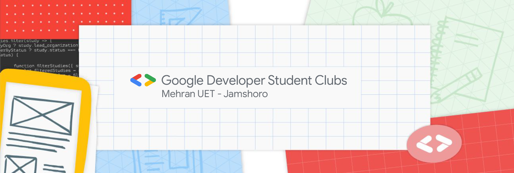

 

## Welcome to Google Developer Student Club - Mehran UET 🚀

 
 

- 👯 We are open for collaborations! 
- 💬 Ask us about anything technical! 
 
Developer Student Clubs are university based community groups for students interested in Google developer technologies. Students from all undergraduate or graduate programs with an interest in growing as a developer are welcome. By joining a DSC, students grow their knowledge in a peer-to-peer learning environment and build solutions for local businesses and their community.  
Mehran UET in itself gives exposure to students on all grounds. For the greater good of technology, It has welcomed its third tenure of GDSC MUET 2021 for the students in STEM, especially from Information-technology related fields.
 
<!-- <h4> ✨Visit our <a href="https://gdscmuet.netlify.app/" target="blank">WEBSITE</a> now! </h4> -->
<h3> 🤗Connect with us at ...</h3>

       

